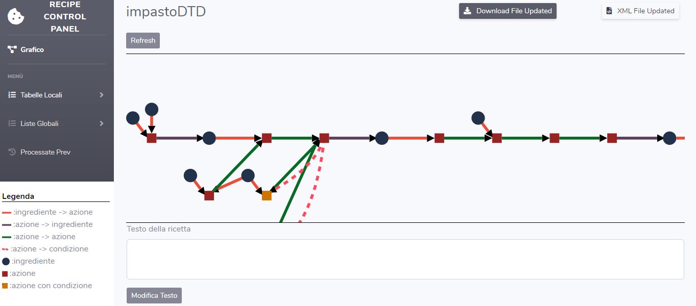

# Applicazione web interattiva per la visualizzazione di ricette gastronomiche

Questo progetto prende in input un file xml , modellato a partire da una rete di Petri modellata a sua volta a partire da una ricetta gastronomica testuale, e attraverso varie elaborazioni restituisce un output fruibile attraverso la visualizzazione di un grafo bipartito. Inoltre l'output può essere modificato andando non solo a modificare il grafo ma anche il file xml per correggere eventuali errori o inesattezze. Infine, il file xml eventualmente modificato, può essere scaricato per eventuali ulteriori elaborazioni esterne o semplicemente visualizzato nel browser. Un copia del file xml , eventualmente modificato, resterà permanentemente nella directory *ricette* e potrà essere consultata in qualsiasi momento.

## Iniziamo

Il progetto è stato sviluppato per la massima flessibilità in termini di ambiente di esecuzione e non ha bisogno di installazioni.

### Pre-requisiti

Per eseguire l'applicazione esistono tre requisiti fondamentali:
* Browser web (Chrome, Firefox ecc... )
* L'applicazione deve essere eseguita su di una macchina che possa eseguire il linguaggio di scripting interpretato PHP (preferibilmente versione 7 o superiore)
* Connessione di rete 

### Installazione

L'applicazione non ha bisogno di installazione ma va eseguita esattamente come l'apertura di un sito web tradizionale, cioè raggiungendo, tramite il browser web, l'indirizzo in cui si trovano i file dell'applicazione.

## Utilizzo

### Index

Una volta raggiunto l'indirizzo in cui si trovano i file dell'applicazione, in particolare l'index, troviamo la seguente schermata:

Ogni volta che l'applicazione verrà avviata si avranno due scelte:

1. Click sul riquadro per inserire un nuovo file XML dal proprio file-system oppure trascinare il file direttamente dentro il riquadro tratteggiato e infine clickare su *prosegui*;

2. Se l'applicazione è già stata utilizzata per la visualizzazione di una o più ricette allora queste saranno state salvate sicuramente, ed è quindi possibile richiamare direttamente i files XML senza reinserirli manualmente di nuovo clickando su *precedenti* e scegliendo il file da utilizzare;

#### Nota:

> Inserire un file con lo stesso nome di qualcuno già elaborato sovrascriverà il vecchio file salvato

### Visualizzazione

Una volta fatta la scelta del file xml da caricare, l'applicazione rimanderà alla pagina di visualizzazione

da questa pagina è possibile visualizzare il grafo bipartito creato partendo dal file XML, in particolare il grafico è stato elaborato inserendo i seguenti elementi:

> ##### Nodi

| Elemento Grafico  | \< Tag \> XML             |
|-------------------|---------------------------|
| Cerchio           | INGREDIENTE               |
| Quadrato (rosso)  | AZIONE (senza condizione) |
| Quadrato (giallo) | AZIONE (con condizione)   |

> ##### Link 

Esistono in particolare 4 tipi di link distinti per colore o tratteggio:

1. Rosso (da ingrediente ad azione), questo tipo di link occorre quando l'ingrediente è pre-condizione dell'azione; 

2. Viola (da azione ad ingrediente), questo tipo di link occorre quando l'ingrediente è post-condizione dell'azione; 

3. Verde (da azione ad azione), questo tipo di link occorre quando :
    * Esiste una relazione d'ordine tra le due azioni sancita dalla direzione del link stesso.
    * Esiste una relazione di simultaneità tra le due azioni per cui dall'azione con condizione parte questa tipologia di link che termina nell'azione principale così da sottolineare il dovere di ritornare al ramo principale una volta che la condizione non sia più soddisfatta.

4. Rosso Tratteggiato (da azione ad azione), questo tipo di link occorre quando , tra le due azioni, esiste una relazione di simultaneità, per cui dall'azione principale parte questa tipologia di link che termina nell'azione avente condizione. Questa tipologia di tratto è leggermente diversa rispetto alle altre poichè si vuole sottolineare la diversa natura del link che verrà sfruttato a patto di soddisfare la condizione preposta; 

> ##### Tabelle Locali

Dal menu a tendina sulla sinistra è possibile raggiungere la visualizzazione di quattro tabelle diverse:

1. Ingredienti 
2. Azioni
3. Quantità usate
3. Condizioni

Per ognuna delle tabelle è stata creata una sezione che permette la visualizzazione dei contenuti corrispondenti oltre alla modifica parziale degli stessi.

> ##### Liste Globali

Questa tipologia di lista è stata sviluppata per permettere di tenere traccia nonchè di visualizzare ogni ingrediente o azione elaborati dall'applicazione fino a quel momento.
  
Ogni volta che inserisco un nuovo file XML: 
* Le azioni, che non abbiano lo stesso nome di altre già inserite nella lista, vengono inserite automaticamente; 

* Gli ingredienti nuovi non vengono inseriti automaticamente, come per le azioni, ma sotto la supervisione dell'utente che deciderà se tenere o cambiare il nome di ogni singolo ingrediente nuovo da inserire, così da permettere all'utente di non avere lo stesso ingrediente con più nomi diversi tra loro (es.*UOVO* <-> *UOVA* ecc... ), ovviamente il cambio del nome di un ingrediente nuovo da inserire non influirà solo rispetto alla lista di ingredienti globale ma anche il nome dell'ingrediente stesso della ricetta cambierà di conseguenza.

### Download

Il file XML caricato, ed eventualmente modificato, può in qualunque momento essere scaricato clickando questo tasto che si trova in qualunque pagina dell'applicazione

### Visualizzazione file XML

Il file XML caricato, ed eventualmente modificato, può in qualunque momento essere ispezionato clickando questo tasto che si trova in qualunque pagina dell'applicazione

### Inserimento testo ricetta

E' possibile inserire il testo della ricetta originale oppure, se già inserito, modificarlo.
L'attività è molto semplice, basta inserire il testo desiderato nella text-box sotto e cliccare il tasto Modifica Testo.

### Modifica Principale

La modifica del file XML caricato nell'applicazione può avvenire in due modi distinti, ognuno di questi non può modificare tutti gli elementi del file.
Le modalità sono:

#### Da Tabella 

> ##### Modifica Ingrediente
La visualizzazione della tabella per la modifica dell'ingrediente è la seguente 

In questa pagina è possibile visualizzare le seguenti informazioni:

+ id
+ nome
+ quantità (totale)
+ immagine

è possibile aggiungere un nuovo ingrediente clickando il seguente pulsante in alto a sinistra
 
 

 a partire da quest'azione verrà visualizzato un form in primo piano con le info più importanti quali:

+ nome
+ quantità
+ immagine

in particolare il campo *nome* offre dei suggerimenti durante l'inserimento e questi sono nomi di ingredienti della lista di ingredienti globali 

> ###### Nota
> ###### il campo *nome* a differenza degli altri non deve essere lasciato vuoto. E' comunque consigliabile, quando si modifica, non lasciare nessun campo vuoto e non cancellare del tutto i campi con valori.

Clickando invece sul tasto arancione, che si trova nella tabella nella colonna corrispondente per ogni ingrediente, verrà visualizzato un form di inserimento quasi identico al form di aggiunta di un ingrediente, la variazione sta nei campi che avranno già dei valori inseriti in base all'ingrediente da modificare.
Clickando invece sul tasto rosso, che si trova nella tabella nella colonna corrispondente per ogni ingrediente, verrà visualizzato un bottone da clickare per confermare l'eliminazione.

  

> ##### Modifica Azione

La visualizzazione della tabella per la modifica dell'azione è la seguente 

In questa pagina è possibile visualizzare le seguenti informazioni:

+ id
+ nome
+ durata
+ pre-condizioni
+ post-condizioni

è possibile aggiungere una nuova azione clickando il pulsante in alto a sinistra simile a quello per la modifica dell'ingrediente, a partire da questo verrà visualizzato un form in primo piano con le info da aggiungere più importanti quali:

+ nome
+ durata
+ immagine

in particolare il campo *nome* offre dei suggerimenti durante l'inserimento e questi sono nomi di azioni della lista di azioni globali.
La modifica e l'eliminazione hanno gli stessi identici tasti rispetto alla modifica dell'ingrediente e quindi le stesse funzionalità.

#### Da Grafico

>##### Inserimento nuovo nodo

Clickando con il tasto destro e scegliendo una delle azioni, è possibile inserire un nuovo nodo direttamente nella posizione del click del mouse, i nodi da poter inserire sono 3:  
1. **Ingrediente**, inserendo questo tipo di nodo è possibile stabilire le seguenti info:
    * nome
    * quantità (totale)
    * immagine

2. **Azione**, inserendo questo tipo di nodo è possibile stabilire le seguenti info:
    * nome
    * durata
    * immagine

3. **Azione Condizione**, inserendo questo tipo di nodo è possibile stabilire le seguenti info:
    * nome
    * durata
    * condizione
    * immagine
  >###### Nota
  >###### L'unico campo obbligatorio è il nome, tutti gli altri è possibile ometterli.

>##### Edit Link
Una delle modifiche più importanti è l'aggiunta di nuovi link o la modifica di quelli già esistenti.
Per poterlo fare basta il click prolungato su di un nodo per inserire un link nuovo oppure click prolungato su di un link già esistente per modificarne la direzione e ,tenendo premuto, infine trascinare il link nuovo o esistente fino al nodo a cui si vuole collegare l'altro capo.  
Se viene portata a termine la modifica di un link esistente allora verrà eliminato il collegamento precedente e inserito quello nuovo. Sia per la modifica che per l'inserimento da nuovo avvengono le seguenti elaborazioni in base al tipo di collegamento portato a termine:

| Nodo Source | Nodo Target |  < tag > Inserito |
|-------------|---------|--------------------------------|
| Ingrediente | Azione  | INGREDIENTE in PRE-CONDIZIONE |
| Azione  | Ingrediente | INGREDIENTE in POST-CONDIZIONE |
| Azione | Azione | RELAZIONE D'ORDINE |

Infine è possibile inserire una tipologia particolare di link che è il link condizionato (quello tratteggiato), per poterlo inserire si deve creare un loop (due link sugli stessi nodi con direzioni opposte) tra due azioni di cui una possiede il campo condizione.

>##### Cancellazione
Puntando il muose sopra l'elemento da cancellare, clickando il tasto destro e infine cliccando il tasto "cancella", apparirà un form che chiederà conferma della cancellazione dell'elemento specifico, clickando sulla conferma, l'elemento verrà rimosso(se un nodo anche i collegamenti ad esso o da esso verranno cancellati). 

## Sviluppato con

I linguaggi utilizzati per l'elaborazione sono :
* Js
* PHP
* jQuery

Mentre la formattazione testuale è stata scritta in:
* HTML
* CSS

Per la progettazione grafica invece sono stati utilizzati le seguenti librerie:
* Bootstrap v4.1.3
* Font Awesome Free 5.11.2

## Author

**Luca Barbagallo** 

## License

This project is licensed under the MIT License - see the [LICENSE](LICENSE) file for details

