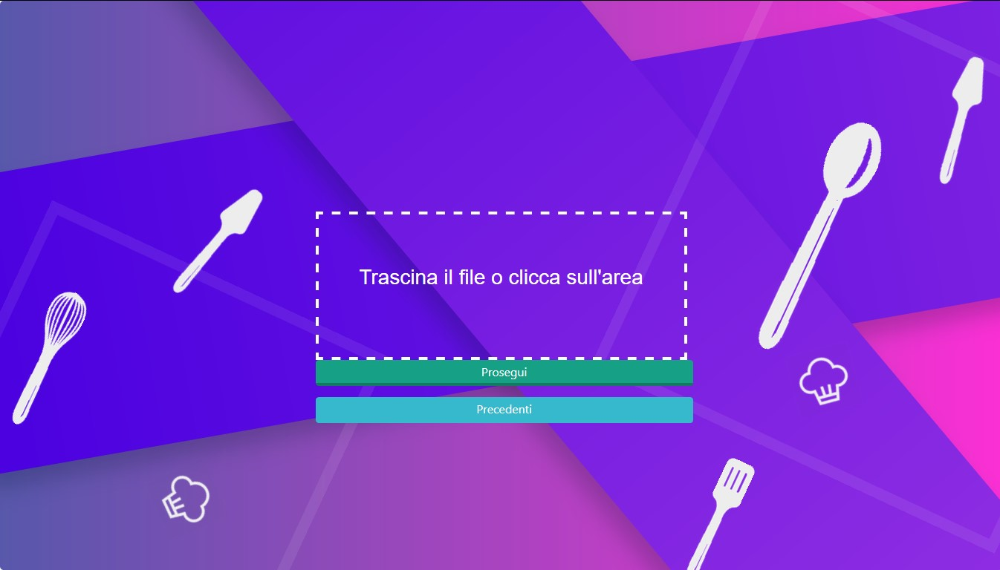
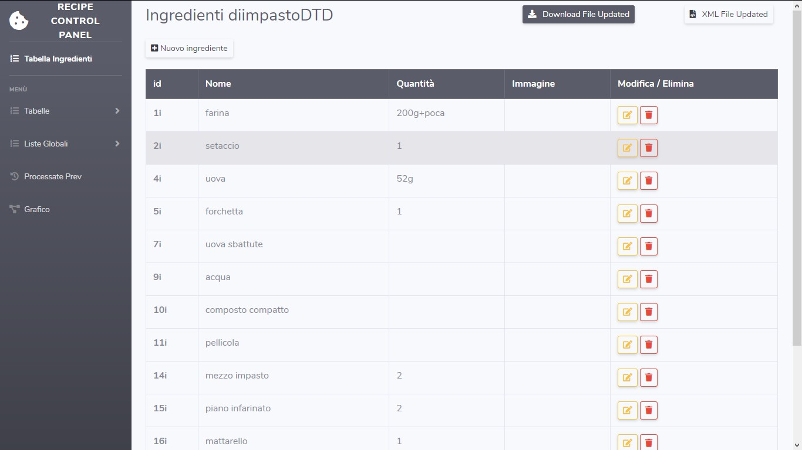

# Applicazione web interattiva per la visualizzazione di ricette gastronomiche

Questo progetto prende in input un file xml ,modellato a partire da una rete di Petri modellata a sua volta a partire da una ricetta gastronomica testuale, e attraverso varie elaborazioni restituisce un output fruibile attraverso la visualizzazione di un grafo bipartito. Inoltre l'output può essere modificato andando non solo a modificare il grafo ma anche il file xml per correggere eventuali errori o inesattezze. Infine, il file xml eventualmente modificato, può essere scaricato per eventuali ulteriori elaborazioni esterne o semplicemente visualizzato nel browser. Un copia del file xml , eventualmente modificato, resterà permanentemente nella directory *ricette* e potrà essere consultata in qualsiasi momento.

## Iniziamo

Il progetto è stato sviluppato per la massima flessibilità in termini di ambiente di esecuzione e non ha bisogno di installazioni.

### Prerequisiti

Per eseguire l'applicazione esistono di tre requisiti fondamentali:
 * Browser web (Chrome, Firefox ecc...)
 * La posizione fisica dei file dell'applicazione deve essere su di una macchina che possa eseguire il linguaggio di scripting interpretato PHP (preferibilmente versione 7 o superiore)
 * Connessione di rete 

### Installazione

L'applicazione non ha bisogno di installazione ma va eseguita esattamente come l'apertura di un sito web tradizionale, cioè raggiungendo, tramite il browser web, l'indirizzo in cui si trovano i file dell'applicazione.

## Utilizzo

### Iniziamo

Una volta raggiunto l'indirizzo in cui si trovano i file dell'applicazione, in particolare l'index, troviamo la seguente schermata:

Ogni volta che l'applicazione verrà avviata si avranno due scelte:

1. Click sul riquadro per inserire una nuova ricetta dal proprio sistema oppure trascinarla direttamente dentro il riquadro tratteggiato e infine clickare su *prosegui*;

2. Se l'applicazione è già stata utilizzata per la visualizzazione di una o più ricette allora queste saranno state salvate sicuramente, ed è quindi possibile richiamare direttamente i files XML senza reinserirli manualmente di nuovo clickando su *precedenti* e scegliendo il file da utilizzare;

#### Nota:

> Inserire un file con lo stesso nome di qualcuno già elaborato sovrascriverà il vecchio file salvato

### Visualizzazione

Una volta fatta la scelta del file xml da caricare, l'applicazione rimanderà alla pagina di visualizzazione

da questa pagina è possibile visualizzare il grafo bipartito creato partendo dal file XML, in particolare il grafico è stato elaborato inserendo i seguenti elementi:

> ##### Nodi

Elemento Grafico | \< Tag \> XML
---------------- | -------
Cerchio | INGREDIENTE
Quadrato (rosso) | AZIONE (senza condizione)
Quadrato (giallo) | AZIONE (con condizione)

> ##### Link 
Esistono in particolare 4 tipi di link distinti per colore o tratteggio:

 1. Rosso (da ingrediente ad azione), questo tipo di link occorre quando l'ingrediente è pre-condizione dell'azione;

 2. Viola (da azione ad ingrediente), questo tipo di link occorre quando l'ingrediente è post-condizione dell'azione;

 3. Verde (da azione ad azione), questo tipo di link occorre quando :
      * Esiste una relazione d'ordine tra le due azioni sancita dalla direzione del link stesso.
      * Esiste una relazione di simultaneità tra le due azioni per cui dall'azione con condizione parte questa tipologia di link che termina nell'azione principale così da sottolineare il dovere di ritornare al ramo principale una volta che la condizione non sia più soddisfatta.

 4. Rosso Tratteggiato (da azione ad azione), questo tipo di link occorre quando ,tra le due azioni, esiste una relazione di simultaneità, per cui dall'azione principale parte questa tipologia di link che termina nell'azione avente condizione. Questa tipologia di tratto è leggermente diversa rispetto alle altre poichè si vuole sottolineare la diversa natura del link che verrà sfruttato a patto di soddisfare la condizione preposta;

> ##### Tabelle Locali
Dal menu a tendina sulla sinistra è possibile raggiungere la visualizzazione di quattro tabelle diverse:

 1. Ingredienti 
 2. Azioni
 3. Quantità usate
 3. Condizioni

Per ognuna delle tabelle è stata creata una sezione che permette la visualizzazione dei contenuti corrispondenti oltre alla modifica parziale degli stessi.

> ##### Liste Globali
Questa tipologia di lista è stata sviluppata per permettere di tenere traccia nonchè di visualizzare ogni ingrediente o azione elaborati dall'applicazione fino a quel momento.  
  
Ogni volta che inserisco un nuovo file XML: 
 * Le azioni, che non abbiano lo stesso nome di altre già inserite nella lista, vengono inserite automaticamente;

 * Gli ingredienti nuovi non vengono inseriti automaticamente, come per le azioni, ma sotto la supervisione dell'utente che deciderà se tenere o cambiare il nome di ogni singolo ingrediente nuovo da inserire, così da permettere all'utente di non avere lo stesso ingrediente con più nomi diversi tra loro (es. *UOVO* <-> *UOVA*, *MELANZANE* <-> *MELANZANA* ecc...), ovviamente il cambio del nome di un ingrediente nuovo da inserire non influirà solo rispetto alla lista di ingredienti globale ma anche il nome dell'ingrediente stesso della ricetta cambierà di conseguenza.

>###### Nota
>###### Alla lista degli ingrediente è stata data particolare importanza poichè potrebbe avere importante rilevanza per progetti futuri legati o meno al progetto presente.

### Download
Il file XML caricato, ed eventualmente modificato, può in qualunque momento essere scaricato clickando questo tasto che si trova in qualunque pagina dell'applicazione

### Visualizzazione file XML
Il file XML caricato, ed eventualmente modificato, può in qualunque momento essere ispezionato clickando questo tasto che si trova in qualunque pagina dell'applicazione

### Modifica
La modifica del file XML caricato nell'applicazione può avvenire in due modi distinti, ognuno di questi non può modificare tutti gli elementi del file.
Le modalità sono:

 #### Da Tabella 

 > ##### Modifica Ingrediente
 La visualizzazione della tabella per la modifica dell'ingrediente è la seguente 

 

 In questa pagina è possibile visualizzare le seguenti informazioni:
  * id
  * nome
  * quantità (totale)
  * immagine
 

 è possibile aggiungere un nuovo ingrediente clickando il seguente pulsante in alto a sinistra
 
 

 a partire da quest'azione verrà visualizzato un form in primo piano con le info più importanti quali:
  * nome
  * quantità
  * immagine

 in particolare il campo *nome* offre dei suggerimenti durante l'inserimento e questi sono nomi di ingredienti della lista di ingredienti globali 

 > ###### Nota
 > ###### il campo *nome* a differenza degli altri non deve essere lasciato vuoto.

 Clickando invece sul tasto arancione, che si trova nella tabella nella colonna corrispondente per ogni ingrediente, verrà visualizzato un form di inserimento quasi identico al form di aggiunta di un ingrediente, la variazione sta nei campi che avranno già dei valori inseriti in base all'ingrediente da modificare.  
 Clickando invece sul tasto rosso, che si trova nella tabella nella colonna corrispondente per ogni ingrediente, verrà visualizzato un bottone da clickare per confermare l'eliminazione.

  

## Sviluppato con

I linguaggi utilizzati per l'elaborazione sono :
 * Js
 * PHP
 * jQuery

Mentre la formattazione testuale è stata scritta in:
 * HTML
 * CSS

Per la progettazione grafica invece sono stati utilizzati:
 * Bootstrap v4.1.3
 * Font Awesome Free 5.11.2

## Contributing

## Versioning

 

## Author

**Luca Barbagallo** 

## License

This project is licensed under the MIT License - see the [LICENSE.md](LICENSE.md) file for details
